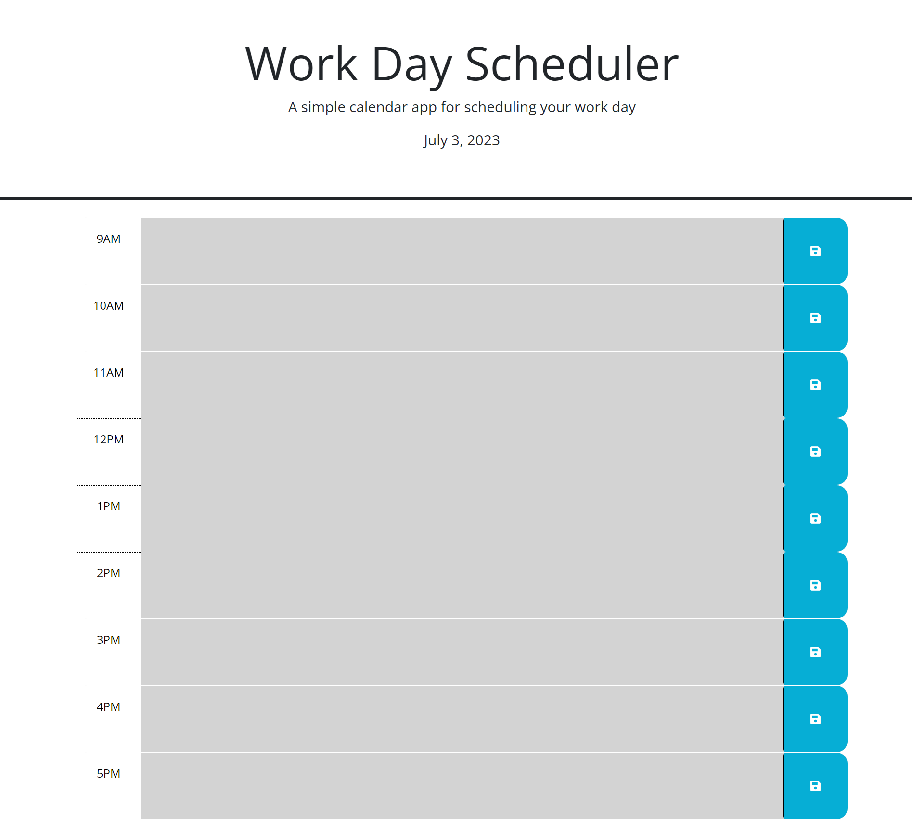
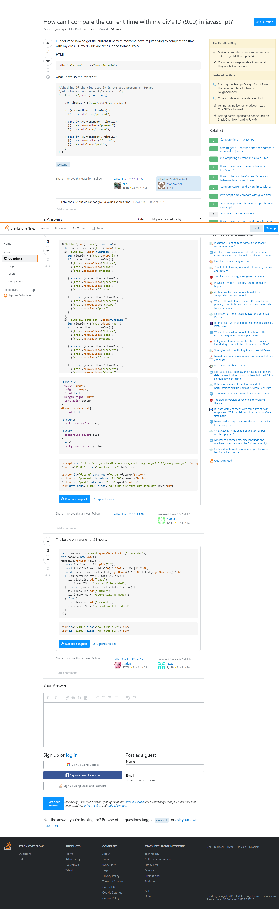

# <Coder's-Calendar>

## Description

This is a website that is designed to be used to help maximize the potential out of the work day by giving the user the ability to schedule what they are going to be doing during a given hour in the work day. This is a great way to help improve productibility and a great way to be self-sufficient in doing the tasks that need to be done on a daily basis. This project was built as a freelancers helper because it will the give the user a way to eliminate distractions. 

## Installation

Go to this URL: https://cecrouch01.github.io/Coders-Calendar/

## Usage

Go to https://cecrouch01.github.io/Coders-Calendar/ once the user will be able to see a textbox for each hour of the business day. If the box is colored grey (past), red (present), and green (future). The user can then type what needs to be done during that time period and will be able to save it by hitting the save button. 

   
 
  

## Credits

I used bootstrap and JQuery as Third Party API's. 
I used this website to help me figure out how to dynamically change the past/present/future textbox color written by user "Xupitan" https://stackoverflow.com/questions/72512032/how-can-i-compare-the-current-time-with-my-divs-id-900-in-javascript

## License

MIT License

Copyright (c) 2023 Caleb Crouch

Permission is hereby granted, free of charge, to any person obtaining a copy of this software and associated documentation files (the "Software"), to deal in the Software without restriction, including without limitation the rights to use, copy, modify, merge, publish, distribute, sublicense, and/or sell copies of the Software, and to permit persons to whom the Software is furnished to do so, subject to the following conditions:

The above copyright notice and this permission notice shall be included in all copies or substantial portions of the Software.

THE SOFTWARE IS PROVIDED "AS IS", WITHOUT WARRANTY OF ANY KIND, EXPRESS OR IMPLIED, INCLUDING BUT NOT LIMITED TO THE WARRANTIES OF MERCHANTABILITY, FITNESS FOR A PARTICULAR PURPOSE AND NONINFRINGEMENT. IN NO EVENT SHALL THE AUTHORS OR COPYRIGHT HOLDERS BE LIABLE FOR ANY CLAIM, DAMAGES OR OTHER LIABILITY, WHETHER IN AN ACTION OF CONTRACT, TORT OR OTHERWISE, ARISING FROM, OUT OF OR IN CONNECTION WITH THE SOFTWARE OR THE USE OR OTHER DEALINGS IN THE SOFTWARE.

